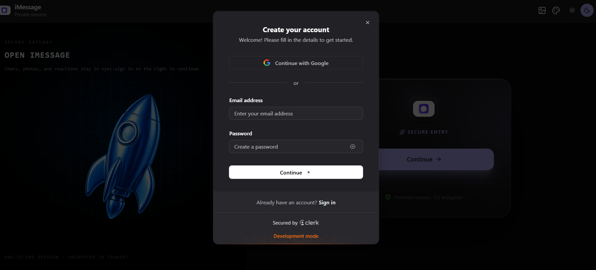
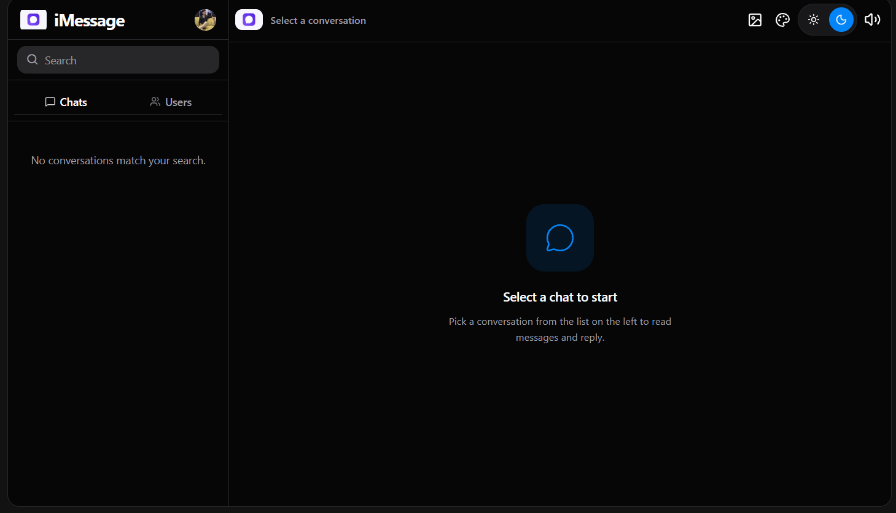
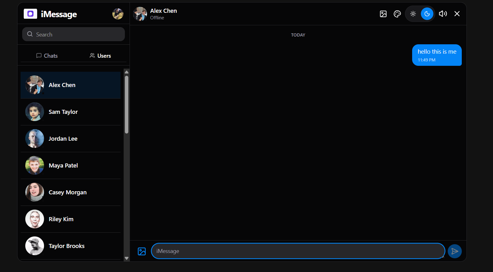
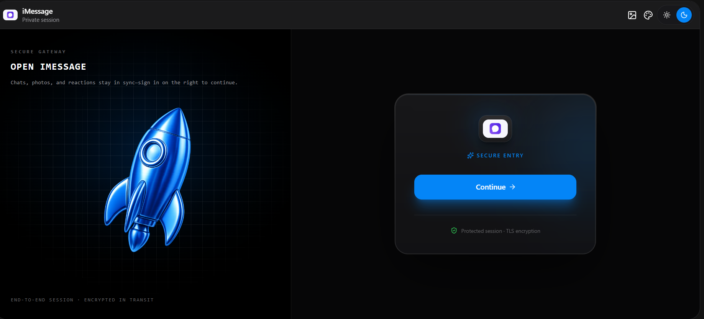

# 💬 Full Stack Real-Time Chat Application

<p align="center">
  
  
  
  
  
  
  
  
</p>

A modern **Full Stack Real-Time Chat Application** built with **React, Node.js, Express.js, MongoDB, Socket.IO, Clerk Authentication, and Docker**.

Supports real-time messaging, media sharing, authentication, customizable themes, online user tracking, and responsive design.

---

# 🚀 Live Demo

🌐 **Live App:** [https://your-render-url.onrender.com](https://echatapp-w5xf.onrender.com/)

---

# 🎥 Demo

> Add a GIF here showing:
>
> Login → Select User → Send Message → Receive Message → Change Theme

Example:

```md

```

---

# 📸 Screenshots

<table>
<tr>
<td align="center">
<b>🔐 Login</b><br><br>

</td>

<td align="center">
<b>🏠 Home</b><br><br>

</td>
</tr>

<tr>
<td align="center">
<b>💬 Chat</b><br><br>

</td>

<td align="center">
<b>🔑 Authentication</b><br><br>

</td>
</tr>
</table>

---

# ✨ Features

- 🔐 Secure Authentication using Clerk
- 💬 Real-Time Messaging
- ⚡ Socket.IO Integration
- 🟢 Online User Presence
- 📷 Image Sharing
- 🎥 Video Sharing
- 🎨 Light & Dark Mode
- 🌈 Multiple Themes
- 🖼️ Custom Wallpapers
- 📁 Media Upload with ImageKit
- 🔄 Persistent Chat History
- 📱 Responsive Design
- ☁️ Docker Deployment
- 🚀 Production Ready

---

# 🛠️ Tech Stack

## Frontend

- React.js
- Tailwind CSS
- Hero UI
- Zustand
- Axios
- Socket.IO Client

## Backend

- Node.js
- Express.js
- MongoDB
- Mongoose
- Socket.IO
- Clerk
- ImageKit

## Deployment

- Docker
- Render
- MongoDB Atlas

---

# 🏗️ Architecture

```text
                React Frontend
                      │
                      │
                  Axios API
                      │
                      ▼
            Express + Node.js
             │             │
             │             │
         Socket.IO      Clerk Auth
             │             │
             └──────┬──────┘
                    │
               MongoDB Atlas
```

---

# 📂 Project Structure

```text
chat-app
│
├── backend
│   ├── controllers
│   ├── middleware
│   ├── models
│   ├── routes
│   ├── lib
│   └── server.js
│
├── frontend
│   ├── src
│   ├── public
│   └── vite.config.js
│
├── screenshots
├── Dockerfile
├── README.md
└── package.json
```

---

# ⚙️ Installation

```bash
git clone [https://github.com/yourusername/chat-app.git](https://github.com/ayushshukla-01/imessage)

cd chat-app

npm install
```

Run Backend

```bash
npm run dev
```

Run Frontend

```bash
cd frontend

npm run dev
```

---

# 🔑 Environment Variables

Backend

```env
PORT=

NODE_ENV=

MONGO_URI=

FRONTEND_URL=

CLERK_PUBLISHABLE_KEY=

CLERK_SECRET_KEY=

CLERK_WEBHOOK_SIGNING_SECRET=

IMAGEKIT_PUBLIC_KEY=

IMAGEKIT_PRIVATE_KEY=

IMAGEKIT_URL_ENDPOINT=
```

Frontend

```env
VITE_CLERK_PUBLISHABLE_KEY=
```

---

# 🐳 Docker

```bash
docker build -t realtime-chat .

docker run -p 3000:3000 realtime-chat
```

---

# 🚀 Future Enhancements

- ✅ Message Seen Status (✓✓ Seen)
- ✅ Typing Indicator
- ✅ Emoji Picker
- ✅ Group Chat
- ✅ Voice Messages
- ✅ Video Calling
- ✅ Audio Calling
- ✅ Edit Messages
- ✅ Delete Messages
- ✅ Reply to Messages
- ✅ Message Reactions
- ✅ Search Messages
- ✅ Friend / Contact System
- ✅ Pinned Chats
- ✅ Message Forwarding
- ✅ Push Notifications
- ✅ End-to-End Encryption
- ✅ AI Chat Assistant
- ✅ File Sharing (PDF, DOCX, ZIP)
- ✅ Drag & Drop Upload
- ✅ User Blocking
- ✅ Chat Backup & Restore

---

# 🤝 Contributing

Contributions are welcome.

Feel free to fork this repository and submit a pull request.

---

# 📄 License

MIT License

---

# 👨‍💻 Author

**Ayush Shukla**

💼 LinkedIn:
www.linkedin.com/in/ayush-shukla-b394a3201


---

## ⭐ Support

If you like this project, consider giving it a ⭐ on GitHub.
